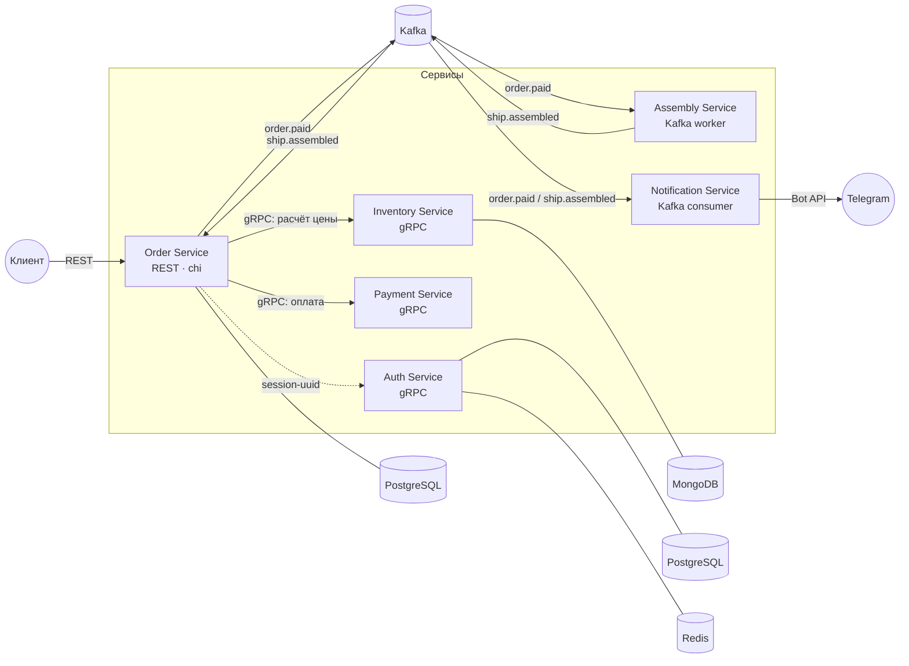

# Spaceship Factory: Microservices Boilerplate

Учебная event-driven платформа для заказа и «сборки» космических кораблей. Проект демонстрирует типовую микросервисную архитектуру на Go: взаимодействие независимых сервисов через REST и gRPC API, асинхронную маршрутизацию через Apache Kafka и полиглотное хранение данных (PostgreSQL, MongoDB, Redis).

---

## Архитектура

Система построена на принципах слабой связности. Синхронное взаимодействие (проверка прав, расчет стоимости) реализовано через **gRPC**. Асинхронные бизнес-процессы (сборка, уведомления) построены на событийно-ориентированной архитектуре (Event-Driven) с использованием брокера **Apache Kafka**.



---

## Жизненный цикл заказа

1. **Создание:** `POST /api/v1/orders` — Сервис `Order` запрашивает наличие деталей у `Inventory`, считает сумму и сохраняет заказ со статусом `PENDING_PAYMENT`.
2. **Оплата:** `POST /api/v1/orders/{order_uuid}/pay` — `Order` вызывает сервис `Payment`, получает `transaction_uuid`, переводит заказ в `PAID` и публикует событие `order.paid` в Kafka.
3. **Сборка:** Сервис `Assembly` получает событие `order.paid`, имитирует сборку корабля (от 10 до 19 секунд) и публикует событие `ship.assembled`.
4. **Завершение:** `Order` получает событие `ship.assembled` и переводит заказ в итоговый статус `COMPLETED`.
5. **Уведомления:** Сервис `Notification` реагирует на события оплаты и сборки, отправляя клиенту сообщения в Telegram.

---

## Описание микросервисов

### 1. Auth Service (gRPC)

Отвечает за регистрацию, логин и проверку прав доступа.

* **Хранение:** Данные в PostgreSQL (пароли хэшируются bcrypt), активные сессии кэшируются в Redis.
* **Интеграция:** Предоставляет `gRPC Interceptor` (middleware) для сквозной проверки авторизации в других сервисах.

### 2. Order Service (REST API)

Управляет жизненным циклом заказов на постройку космических кораблей.

* **Хранение:** Данные надежно хранятся в PostgreSQL (используется драйвер `pgxpool` и Query Builder `squirrel`).
* **Интеграция:** Синхронно общается с `Inventory` и `Payment`, а также публикует события в Kafka.

### 3. Inventory Service (gRPC)

Каталог деталей для сборки кораблей.

* **Хранение:** Номенклатура хранится в документоориентированной СУБД MongoDB (позволяет гибко фильтровать детали по категориям, тегам и производителям).

### 4. Payment Service (gRPC)

Изолированный сервис оплаты заказов, симулирующий работу внешнего платёжного шлюза.

* **Логика работы:** Является stateless-сервисом (не сохраняет состояние). Принимает команду на оплату и генерирует уникальный UUID транзакции.

### 5. Assembly Service (Kafka Worker)

«Сборочный цех». Асинхронный воркер, который не имеет собственной БД. Он просто реагирует на оплаченные заказы, выполняет бизнес-логику сборки и публикует результат в шину данных.

### 6. Notification Service (Kafka Consumer)

Асинхронный сервис-уведомитель, работающий в фоновом режиме. Формирует шаблонные текстовые сообщения и отправляет их клиенту через интеграцию с Telegram Bot API.

> **Общие модули (`platform` и `shared`):** Вся переиспользуемая инфраструктура (обёртки над Kafka, Redis-кэш, логгеры, миграторы) и сгенерированные Protobuf-контракты вынесены в отдельные подключаемые модули для исключения дублирования кода.

---

## API Справочник

### REST API (Order Service)

*Все запросы требуют передачи заголовка `X-Session-Uuid` (проверяется middleware и прокидывается в gRPC-метаданные).*

| Метод | Эндпоинт | Описание |
| --- | --- | --- |
| `POST` | `/api/v1/orders` | Создать заказ из списка деталей → Возвращает `201` + `order_uuid`, `total_price` |
| `GET` | `/api/v1/orders/{order_uuid}` | Получить информацию о заказе |
| `POST` | `/api/v1/orders/{order_uuid}/pay` | Оплатить заказ → Возвращает `transaction_uuid` |
| `POST` | `/api/v1/orders/{order_uuid}/cancel` | Отменить заказ → Возвращает `204` (доступно только для статуса `PENDING_PAYMENT`) |

---

## Быстрый старт и локальный запуск

Для быстрого развертывания всего кластера микросервисов и инфраструктуры используется Docker Compose и утилита **Task**.

1. **Склонируйте репозиторий:**

git clone [https://github.com/anastasii18/boilerplate.git](https://github.com/anastasii18/boilerplate.git)

cd boilerplate

2. **Поднимите инфраструктуру (БД, Kafka, Redis):**

task up-all


3. **Запустите сервисы (миграции БД применятся автоматически):**
```bash
go run ./inventory/cmd/inventory
go run ./payment/cmd/payment
go run ./auth/cmd/auth
go run ./order/cmd/order
go run ./assembly/cmd/assembly
go run ./notification/cmd

```


### Пример запроса (cURL)

Создание нового заказа через REST API:

```bash
curl -X POST http://localhost:8080/api/v1/orders \
  -H 'X-Session-Uuid: <your-session-uuid>' \
  -H 'Content-Type: application/json' \
  -d '{"user_uuid":"<uuid>","part_uuids":["<part-uuid-1>"]}'

```

---

## Стек технологий

* **Язык разработки:** Go 1.24+ (многомодульный репозиторий через `go.work`)
* **API & Протоколы:** HTTP (chi, render), gRPC, Protocol Buffers
* **Брокер сообщений:** Apache Kafka (IBM/sarama в KRaft-режиме)
* **Базы данных:** PostgreSQL (pgxpool, squirrel, goose), MongoDB, Redis
* **Инструменты тестирования:** testify, mockery, testcontainers-go (интеграционные тесты на реальной БД)
* **Инфраструктура:** Docker, Docker Compose, Taskfile
---
## Roadmap (Планы по развитию)

Проект является живым шаблоном и продолжает развиваться. В следующих итерациях планируется внедрение полноценного стека **Observability**:

* **Централизованное логирование (ELK Stack):** Внедрение Elasticsearch, Logstash и Kibana для сбора, агрегации и удобного поиска логов со всех изолированных контейнеров в едином интерфейсе.
* **Сбор метрик (Prometheus & Grafana):** Подключение экспорта базовых технических (нагрузка, память) и кастомных бизнес-метрик (количество созданных заказов, время сборки) для построения дашбордов.
* **Распределенная трассировка (OpenTelemetry / Jaeger):** Интеграция сквозных трейсов для отслеживания полного пути запроса через все синхронные (gRPC) и асинхронные (Kafka) вызовы системы.
---